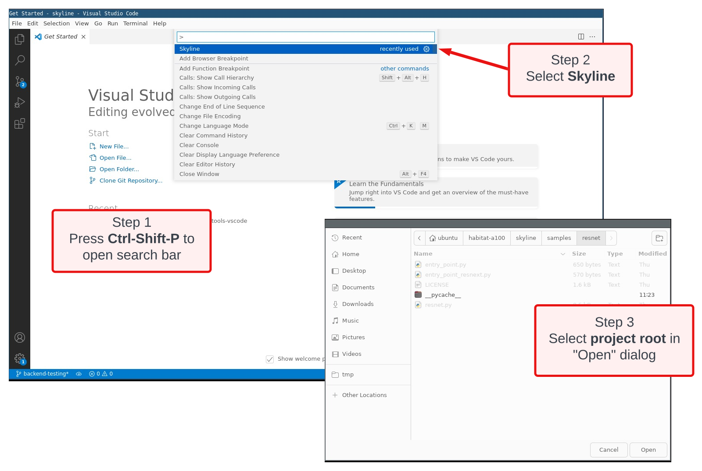
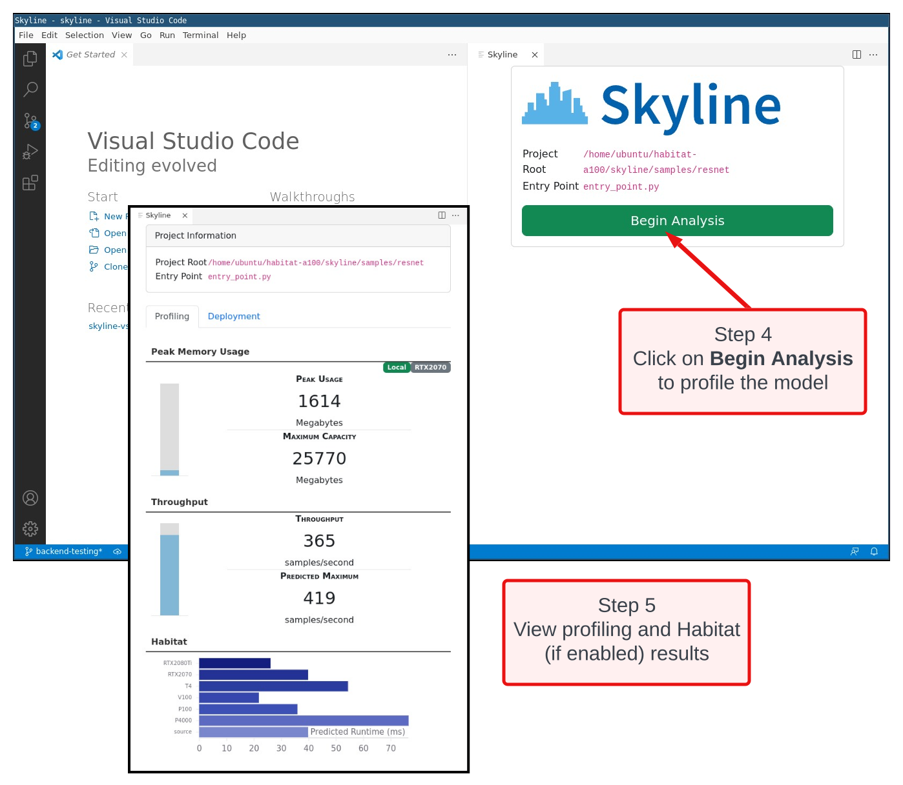

1. Choose an project you want to profile or an example provided in the [DeepView.Profile](https://github.com/CentML/) repo
2. Launch the profiler in your remote workstation or the provided instance. 
    - Activate the virtual environment with `source venv/bin/activate`
    - Run the following command
    ```
    python3 -m skyline interactive --port <PORTNUMBER>
    ```
    Note that if you do not specify a port number, the default port is 60120
2. Run the VSCode extension
    - Open VSCode on your local workstation
    - Connect to your remote workstation via Remote SSH.
    - Press `Ctrl-Shift-P` and select Skyline.
    - Select the project directory containing the entry point `entry_point.py`. Finally, click on `Begin Analysis` to analyze it with ML Tools.
    Note if you changed the port used by the profiler, you need to update the port used by the extension. This is done by going to the DeepView.Profile-VSCode extension settings and updating the port number.





