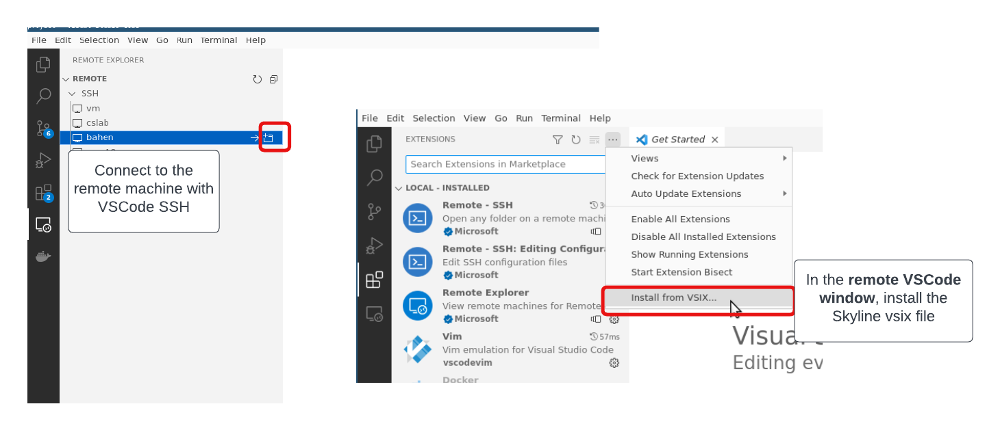

# Environment Setup

## Prerequisites
(If you are connecting to your own Desktop machine) Please ensure a version of PyTorch compiled with CUDA is installed in your current environment. To verify this, run:
```bash
python -c "import torch; print(torch.version.cuda)"
```
which will print the CUDA version PyTorch is compiled with.

Next, clone our repository that contains the source code for the demo.
```bash
git clone https://github.com/CentML/asplos23-tutorial.git
```

## Running the Jupyter Notebook
First, create a virtual environment and install the necessary dependencies.
```bash
virtualenv venv && source venv/bin/activate
pip install jupyter
```

Next, launch the notebook from the `project` directory:
```bash
cd asplos23-tutorial/project
jupyter notebook --ip 0.0.0.0
```

To connect to the notebook, following one of the listed instructions depending on your setup:
* **If using your own workstation**, create a tunnel to your machine with:
```bash
ssh -L 8888:localhost:8888 <machine_ip>
```
* **If using one of our provided VMs**, access the notebook directly at `<machine_ip>:8888`.

## Install DeepView Backend
**The following components should be installed on your GPU workstation.**

The DeepView backend provides utility to profile your DL models (DeepView.Profile) as well as to predict its performance on other hardware (DeepView.Predict).

We install DeepView.Profile with:
```bash
pip install git+https://github.com/centml/DeepView.Profile.git
```

Next, install DeepView.Predict:
```bash
pip install http://centml-releases.s3-website.us-east-2.amazonaws.com/habitat/wheels-cu117/habitat_predict-1.0.0-0+cu117-py310-none-any.whl
```

{: .important}
> Note, depending on the version of Python and CUDA installed on your machine, you might need to install the correct version of DeepView.Predict based on your environment:
> ```bash
export CUDA_VERSION=cu117
export PYTHON_VERSION=py39
pip install http://centml-releases.s3-website.us-east-2.amazonaws.com/habitat/wheels-${CUDA_VERSION}/habitat_predict-1.0.0-0+${CUDA_VERSION}-${PYTHON_VERSION}-none-any.whl
```

## Install DeepView Frontend (DeepView.Explore)
Get the VSIX file with the following command in your **remote machine**

```bash
curl http://centml-releases.s3-website.us-east-2.amazonaws.com/skyline-vscode/skyline-vscode-0.1.0.vsix --output skyline-vscode-0.1.0.vsix
```

Launch VSCode on your **local machine** and connect to your **remote machine** with VSCode SSH. You will need the `Remote - SSH` extenstion installed on your local VSCode app.

Inside your remote VSCode connection, install the VSIX file as shown in the screenshot below.


